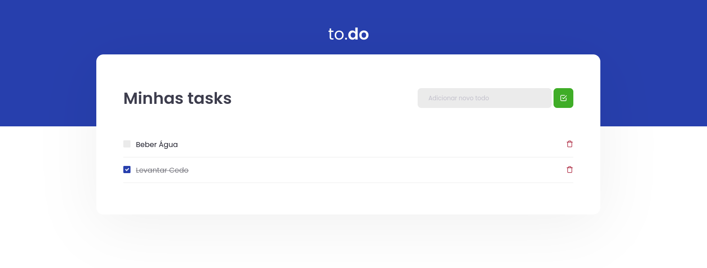

<h1 align="center">
  
</h1>

## 💬  Sobre
to.do é uma pequena aplicação de atividades a fazer, elaborada durante o ignite da RocketSeat comas funções

- Adicionar uma nova tarefa
- Remover uma tarefa
- Marcar e desmarcar uma tarefa como concluída

Fazer com que seja possivel adicionar e remover tarefas, e passar nos testes sugeridos.

## 👨🏻‍🚀 Me acompanhe no Linkedin também:

